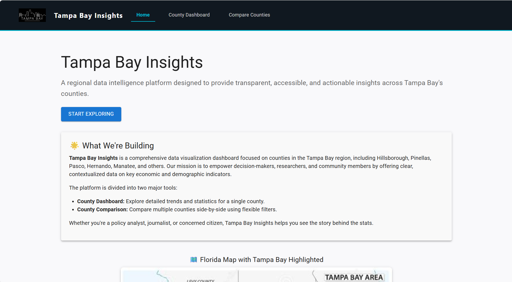
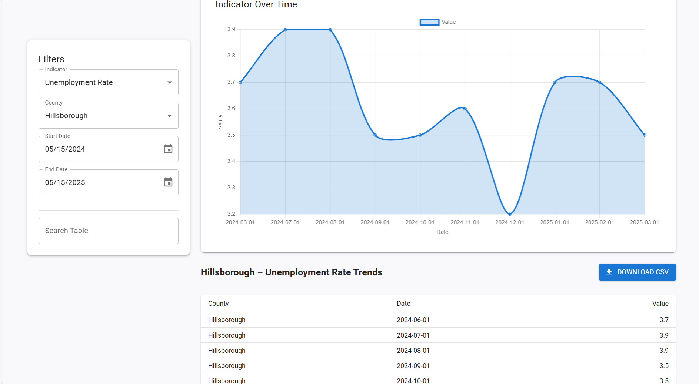
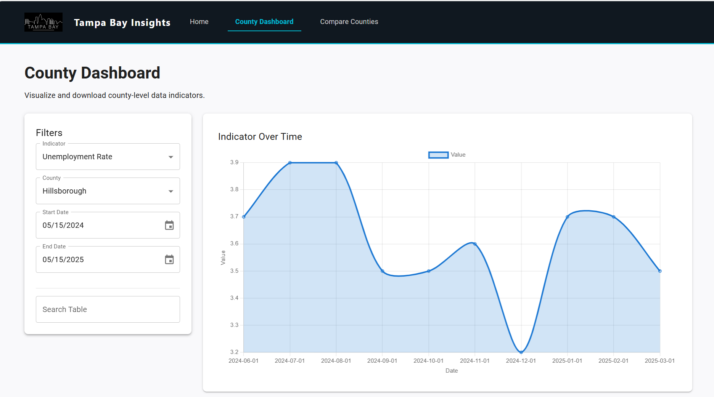
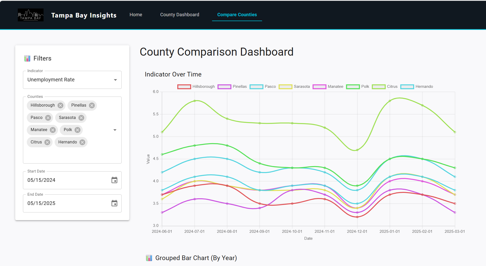

# 🌴 Tampa Bay Insights Dashboard

**Tampa Bay Insights** is a regional data intelligence platform that empowers policy-makers, researchers, and citizens by providing transparent and accessible insights into key economic and demographic indicators across counties in the Tampa Bay region.

---

##  Features

- **County Dashboard**  
  Visualize economic indicators over time for a single county with line charts and interactive filters.

- **County Comparison Tool**  
  Compare multiple counties side-by-side using both line and grouped bar charts for clearer trend analysis.

- **Filters & Controls**  
  - Select from various economic/demographic indicators
  - Filter by multiple counties
  - Customize date ranges using pickers

- **Dynamic Charts**  
  Built with `Chart.js` using `react-chartjs-2`, includes responsive and animated charts.

- **Data Table + Search**  
  See raw values and search entries by date or value.

- **CSV Download**  
  Export any filtered dataset with a single click.

- **Fully Responsive UI**  
  Built with Material UI and optimized for modern browsers.

---

##  Tech Stack

| Frontend       | Libraries                         |
|----------------|-----------------------------------|
| React          | React 18+                         |
| Material UI    | @mui/material                     |
| Charts         | chart.js + react-chartjs-2        |
| Date Handling  | dayjs                             |
| HTTP Requests  | axios                             |
| Routing        | react-router-dom                  |

---

---

## Getting Started

### Prerequisites

Make sure you have:

- Node.js ≥ 16
- npm or yarn
- Git

---

### ⚙️ Installation

```bash
# Clone the repo
git clone https://github.com/sonalshreya25/TampaBayInsightsDashboard.git

# Move into the folder
cd TampaBayInsightsDashboard

#### Install dependencies
npm install

### Start the development server
npm start

Then visit: http://localhost:3000
```

### Data Source
This dashboard fetches indicator data from a local backend service at:

http://localhost:4000/api/observations?series_id=...

### Customization
Add more indicators in utils/IndicatorUtils.js

##  Screenshots

###  Landing Page


###  County Dashboard – Line Chart


###  County Dashboard – Data Table & Download


###  County Comparison – Line Chart


###  County Comparison – Grouped Bar Chart


