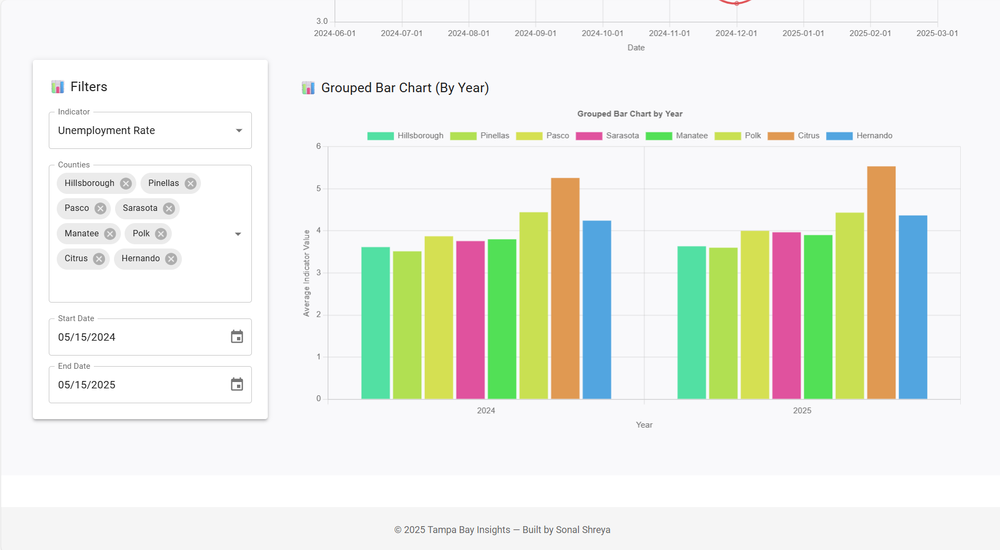

# 🌴 Tampa Bay Insights Dashboard

**Tampa Bay Insights** is a regional data intelligence platform that empowers policy-makers, researchers, and citizens by providing transparent and accessible insights into key economic and demographic indicators across counties in the Tampa Bay region.

---

##  Features

- **County Dashboard**  
  Visualize economic indicators over time for a single county with line charts and interactive filters.

- **County Comparison Tool**  
  Compare multiple counties side-by-side using both line and grouped bar charts for clearer trend analysis.

- **Filters & Controls**  
  - Select from various economic/demographic indicators
  - Filter by multiple counties
  - Customize date ranges using pickers

- **Dynamic Charts**  
  Built with `Chart.js` using `react-chartjs-2`, includes responsive and animated charts.

- **Data Table + Search**  
  See raw values and search entries by date or value.

- **CSV Download**  
  Export any filtered dataset with a single click.

- **Fully Responsive UI**  
  Built with Material UI and optimized for modern browsers.

---

##  Tech Stack

| Frontend       | Libraries                         |
|----------------|-----------------------------------|
| React          | React 18+                         |
| Material UI    | @mui/material                     |
| Charts         | chart.js + react-chartjs-2        |
| Date Handling  | dayjs                             |
| HTTP Requests  | axios                             |
| Routing        | react-router-dom                  |

---
### 🔌 Backend Functionality

This project includes a lightweight **Node.js + Express** backend that acts as a **proxy server** for fetching data from the [FRED API](https://fred.stlouisfed.org/). It enhances security, avoids CORS issues, and allows flexible data processing.

---

#### Why We Use a Backend

- **Secure the API Key:** Keeps your FRED API key hidden from the frontend.
- **Bypass CORS:** Prevents browser restrictions on cross-origin requests.
- **🛠Future Flexibility:** Easy to scale, cache responses, or add authentication.


The backend listens at: http://localhost:4000/api/observations?series_id=XXXX


It forwards the request to:  https://api.stlouisfed.org/fred/series/observations

Along with:
- `series_id`
- your FRED `api_key`
- file type set to `json`

Then it returns the API response directly to the frontend in clean JSON format.

---

#### Technologies Used

- **Node.js**
- **Express.js**
- **Axios** for making HTTP requests
- **CORS** middleware to enable frontend access

---

## Getting Started

### Prerequisites

Make sure you have:

- Node.js ≥ 16
- npm or yarn
- Git

---

### ⚙️ Installation

```bash
# Clone the repo
git clone https://github.com/sonalshreya25/TampaBayInsightsDashboard.git

# Move into the folder
cd TampaBayInsightsDashboard
### Start backend proxy server

### If running for the first time
npm init -y

npm install express axios cors
### Start proxy server
node server\index.js
## Steps to start Frontend application
#### Install dependencies
npm install

### Start the development server
npm start

Then visit: http://localhost:3000
```

### Data Source
This dashboard fetches indicator data from a local backend service at:

http://localhost:4000/api/observations?series_id=...

### Customization
Add more indicators in utils/IndicatorUtils.js

##  Screenshots

###  Landing Page


###  County Dashboard – Line Chart


###  County Dashboard – Data Table & Download


###  County Comparison – Line Chart


###  County Comparison – Grouped Bar Chart


